```{r setup, include=FALSE}
## load libraries
library(knitr)
library(xaringan)
library(xaringanExtra)
library(xaringanBuilder)
library(xaringanthemer)
library(rmarkdown)
library(revealjs)
library(blogdown)
library(dataui)
library(reactable)
library(tidyverse)
library(highcharter)
library(htmlwidgets)
library(widgetframe)
library(crosstalk)
library(manipulateWidget)
library(tibble)
library(svglite)
library(gifski)

## knitr options
options(htmltools.dir.version = FALSE)
knitr::opts_chunk$set(
  fig.path = "figs/",
  fig.width = 12,
  fig.height = 4,
  fig.asp = .5, # might not work
  fig.retina = 3,
  out.width = "100%",
  fig.showtext = TRUE,
  comment = NULL,
  cache = FALSE,
  cache.path = "cache/",
  echo = FALSE,
  message = FALSE,
  warning = FALSE,
  dev = c("svg", "svglite"),
  hiline = TRUE
)
```

```{r xaringan-extra, include=F}
xaringanExtra::use_animate_css(minified = FALSE, xaringan = TRUE)
xaringanExtra::use_tachyons()
xaringanExtra::use_tile_view()
xaringanExtra::use_broadcast()
xaringanExtra::use_scribble()
xaringanExtra::use_panelset()
xaringanExtra::use_webcam()
xaringanExtra::style_panelset_tabs(font_family = "inherit")
xaringanExtra::use_freezeframe()
xaringanExtra::use_fit_screen()
xaringanExtra::use_extra_styles(
  hover_code_line = TRUE, #<<
  mute_unhighlighted_code = TRUE #<<
)
xaringanExtra::use_share_again()
```

name: title
class: title-slide, left, middle
background-image: url(images/daftpunktocat-thomas.gif)
background-position: right
background-repeat: no-repeat
background-size: contain
background-color: var(--usc-black)

.pull-left[
# `r rmarkdown::metadata$title`
## `r rmarkdown::metadata$subtitle`
### `r rmarkdown::metadata$author1`
### `r rmarkdown::metadata$author2`
### `r rmarkdown::metadata$institute`

]

---

name: hello
class: middle, center
background-color: var(--near-black)

## Hello.

???

Our department has grown since 2018

---

class: middle, center
background-color: var(--near-black)

.bg-near-black.b--dark-green.ba.bw2.br3.shadow-5.ph4.mt5[
If you cannot explain something in simple terms, you don't understand it.

.tr[
— Richard Feynman (probably)
]]

.center[]

.footnote[[source](https://twitter.com/proffeynman/status/1370595934191591430)]

???

Richard Feynman was an American theoretical physicist, known for his work in the path integral formulation of quantum mechanics, the theory of quantum electrodynamics, the physics of the superfluidity of supercooled liquid helium, as well as his work in particle physics for which he proposed the parton model.-Wikipedia

---

class: middle

What do I know about .big[ADHD]?

.footnote[
[`r fontawesome::fa("github")` @brainworkup](https://github.com/brainworkup)
[`r fontawesome::fa("twitter")` @brainworkup](https://twitter.com/brainworkup)   
[`r fontawesome::fa("link")` brainworkup.io](https://brainworkup.io)
]

.pull-right[]

???

## 80HD
- PATS preschool study


---
class: center, middle, section

.frame[
### Developmental Trajectory of ADHD
]

This is the model of ADHD from which I work ...

--

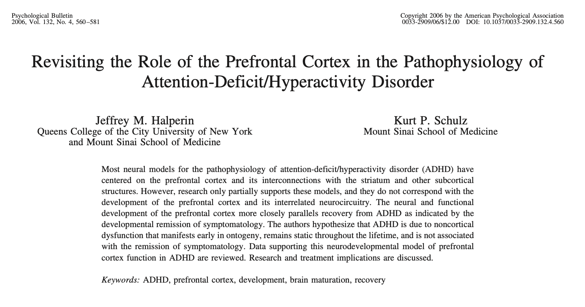

???
#### Notes
- note 
- note

---

class: center, middle

### Cognitive Development in Preschoolers At-Risk for ADHD

.pull-left[
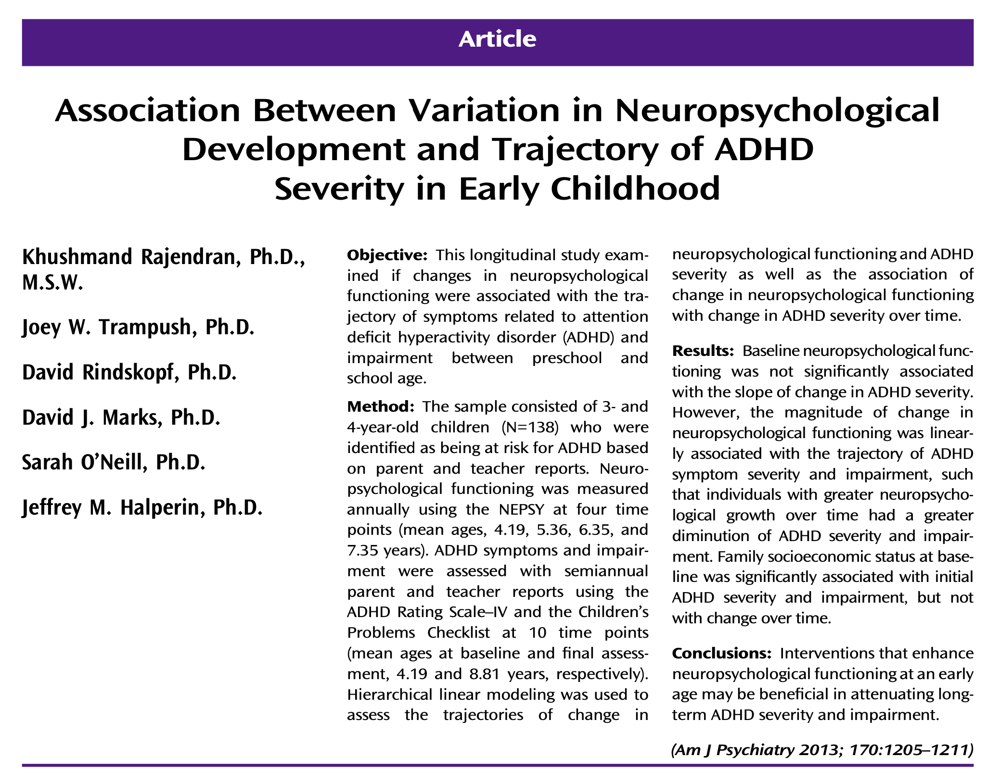
]

.pull-right[
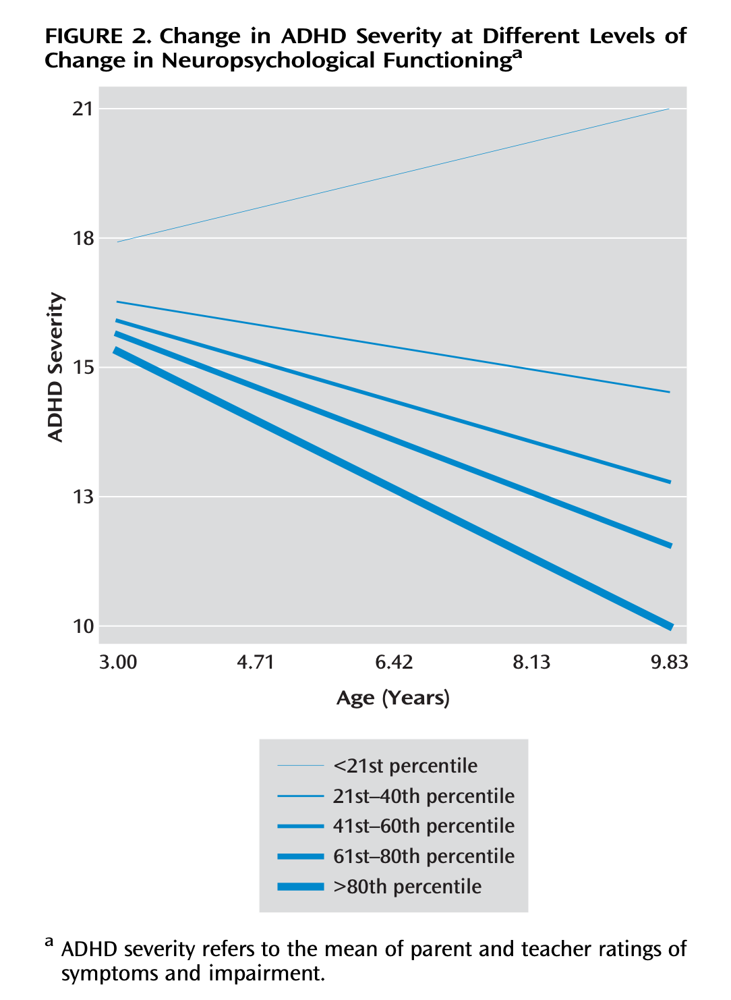
]

???

#### Notes
- note 
- note

---

class: section middle center

## Clinical ADHD .red[vs.] Cognitive ADHD

.pull-left[
### inattention
### hyperactivity
### impulsivity
]

.pull-right[
### attentional fluency
### stimulus-boundedness
### emotion regulation
]

---

class: center, middle

### Recent paper on the CAARS adult ADHD RS

.pull-left[
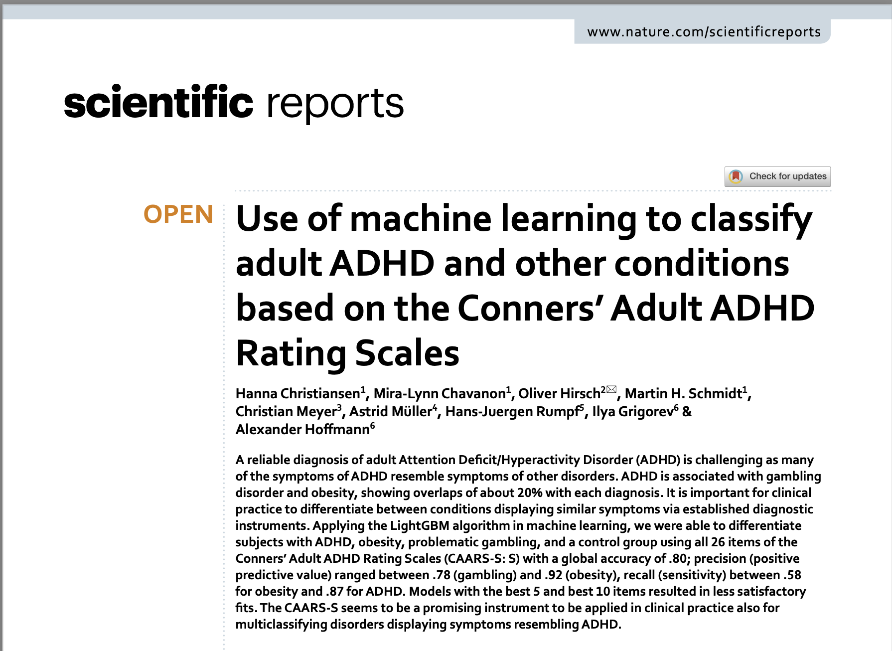
]

.pull-right[
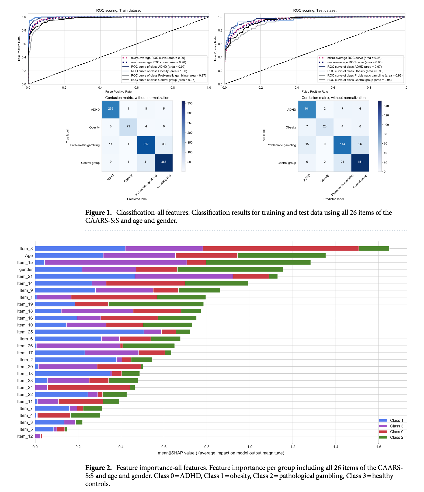
]

---


class: center


---

class: center, middle, f2

`Executive Dysfunction in ADHD`

Three core areas ... 

---

class: center middle

.big[1.]

## attentional fluency

---

class: middle, center

### **Attentional Fluency** = Working Memory + Processing Speed

How .fat-font[much] and how .fat-font[fast] ...

.left.pull-left[
#### Working Memory

- Verbal WM
  - Maintaining verbal information in conscious awareness
  - Fluently retrieving information from LTM
- Nonverbal WM
  - "Mind's eye"
  - "Episodic future thinking"
]

.left.pull-right[
#### Processing Speed/Variability

- Regulating alertness
- Sustaining effort during repetitive, boring tasks
- Adjusting processing speed
- Completing tasks
- Maintaining performance consistency
]

???
- EFT: this is why planning is impaired

---

name: devsci
class: center, middle

#### Working Memory
#### Dopamine Genes
#### Remission of ADHD


.pull-left[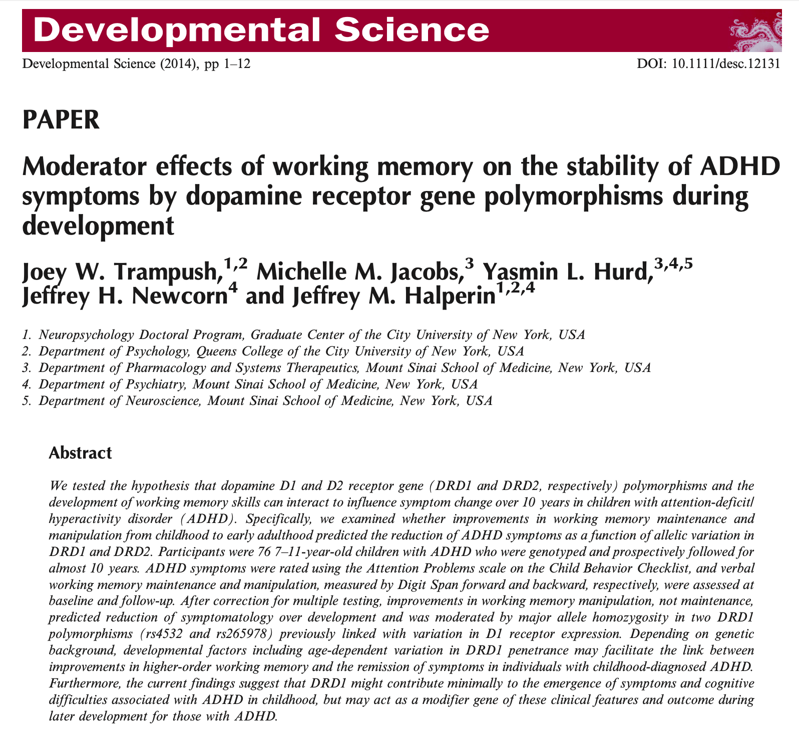]

.pull-right[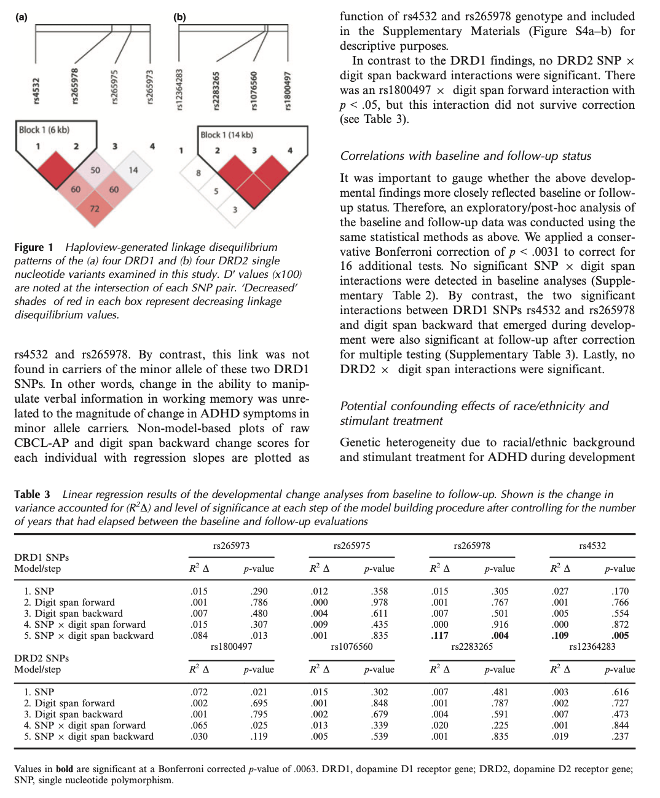]

---

class: center, middle

### GWAS of Working Memory Grant

Currently funded by NIMH to conduct large-scale genome-wide association study (GWAS) of working memory in >25,000 people & >70,000 WM phenotypes & >293,000,000 genetic variants

.pull-left[
  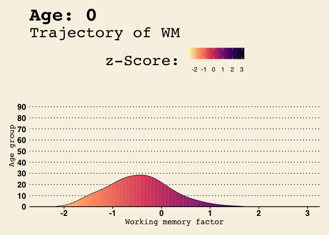
]

.pull-right[
  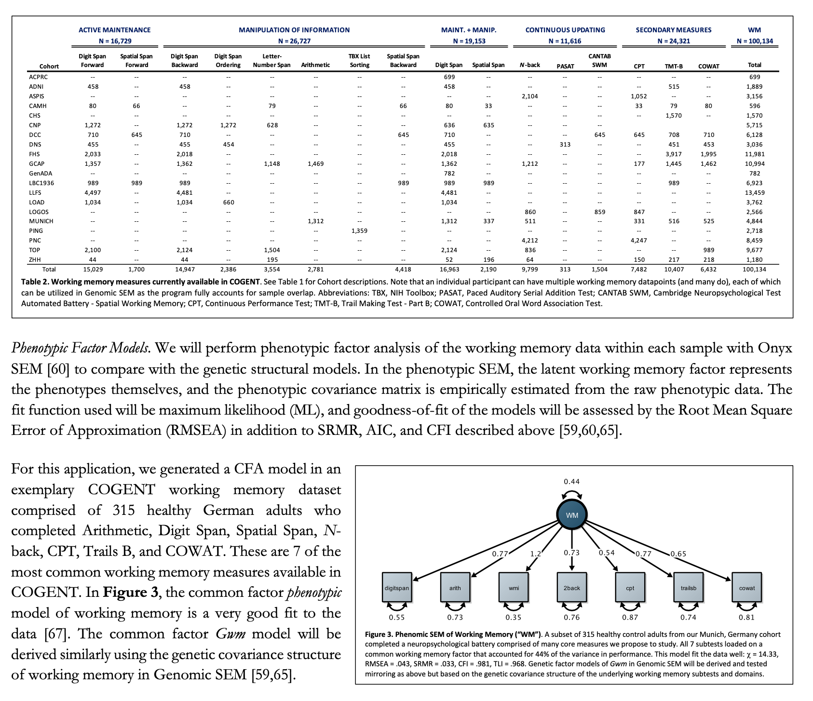
]

???
- interested in students to work on project

---

name: rtsd
class: bottom, left

.left-column[
### RTSD as a biomarker of lifelong ADHD

- Reaction time variability
- Response (in)consistency
- Attentional drift
  - slow RTs
- Impulsive responding
  - fast RTs
]

.right-column[
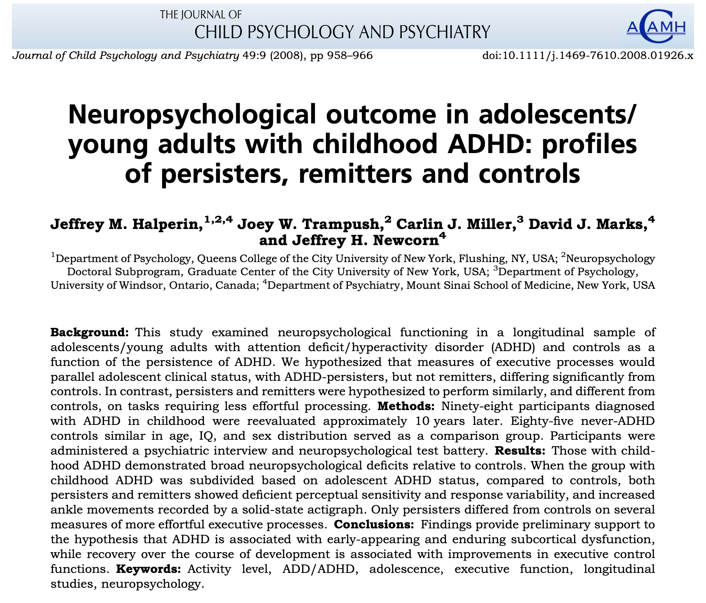
]

---

class: center, middle
background-color: var(--near-black)

.big[2.]

## stimulus-boundedness

---

**Stimulus-boundedness in ADHD**:

--

>...is an inappropriate response to a salient or nonsalient environmental or internal stimulus during cognitive/neuropsychological testing. Environmentally dependent behaviors occur often and cannot be easily redirected and/or environmental dependency makes task completion very difficult, e.g.:

--

>- environmental dependency (e.g., picking up a pen from the table and writing/fidgeting)

--

>- excessive attention to irrelevant objects (e.g., picking up objects from floor)

--

>- during cognitive testing, writing or drawing on a model or adjacent stimulus

--

>- closing in on a stimulus or being distracted by adjacent stimuli

--

>- overtalkativeness, expressing everything that comes to mind


.footnote.small.red[NIH EXAMINER Behavior Rating Scale]

???

- stems from frontal lobe damaged pts

---

class: center, middle
background-color: var(--near-black)

.big[3.]

## emotional & affective
## regulation

---

name: bell
class: left, middle, fullscale
background-image: url(https://gifs.joelglovier.com/crying/laughing-crying.gif)
background-position: 50% 50%
background-size: 100%

## Emotional Control

.pull-left[
> **Emotion** `r emo::ji("fire")`
>
> **(Dys)Regulation**
> 
> in **ADHD**
>
>
> Not part of DSM/ICD diagnostic criteria 
>
> .big[BUT] ...
]

???

This is recognized on most rating scales e.g., brown

---

**Managing Frustration and Modulating Emotions in ADHD** (Brown Executive Function/Attention Scales)

--

>Individuals w/ ADHD often have difficulty with regulating emotional reactions .yellow[**to the extent that they take over much of what the individuals are thinking or doing**]. 

--

>Although the DSM-5 does not recognize any symptoms related to emotion management as an aspect of ADHD, many with the disorder describe chronic difficulties managing:

--

>- frustration, anger, worry, disappointment, desire, and other emotions

--

>- excessive irritability, sensitivity to criticism, overwhelming nervousness and worry, and unhappiness

--

>- They find it very difficult to put their emotions into perspective and get on with what they need to do.

--

>Many speak as though these emotions, when experienced, take over their thinking the way a computer virus might infect a computer and make it impossible for them to attend to anything else.


---

class: center, middle

## Case Presentation

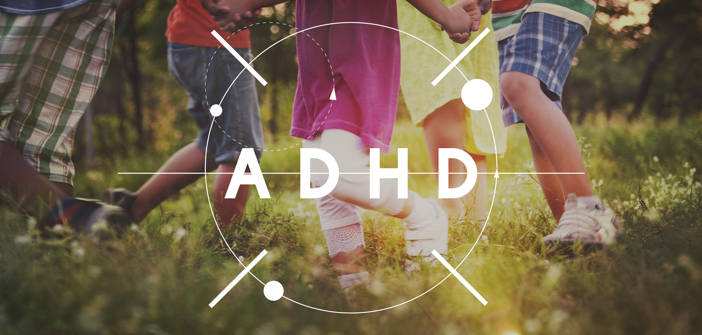

---

class: middle, center

# "Scout"

### Identifying Information

```{r results='asis'}
cat("
<style>
#id {
      font-family: 'Alegreya', 'Spectral', 'STKaiti', serif;
    }
</style>
")
```

```{r results="asis"}
cat("
<style>
.emphasized {
      table-layout: auto;
      width: 100%;
      color: black;
      font-size: 1.5em;
      font-family: 'Roboto Condensed', 'Metrophobic', 'Aldrich';
      break-inside: avoid;
    }
</style>
")
```

|                          |                                                                    |
|--------------------------|--------------------------------------------------------------------|
| **Age:**                 | 10-years, 1-month                        |
| **Sex:**              | Female                                                     |
| **Ethnicity:**           | White/Caucasian                                                    |
| **Handedness:**          | Right                                                    |
| **Education:**           | 4th Grade                                                    |


???

- 874. Scout
- 875. SL

---

class: middle, left

### Reason for Referral

* Scout presented for neuropsychological evaluation to determine her cognitive, academic, and emotional strengths and weaknesses.

* Referred by her parents for behavioral and academic concerns, including:

- behavioral immaturity
- defiance
- attention/executive problems
- reading/learning difficulties

* Purpose of eval was (shockingly:rofl:) to clarify diagnoses and assist with educational and treatment planning

---

class: middle

### Background

- Scout requires frequent redirection and strong reinforcements and consequences in order to manage her behavior.

- She defies parent requests, engages her parents and sister in frequent arguments and periodic acts of aggression, and commits serious rule violations (e.g., lying, stealing).

- Parents struggle with discipline and feel frustrated.

- Behaviorally, she acts "immature" and will throw unprovoked tantrums.

---

class: middle

#### ...continued 

- Parents describe Scout as having a "lack of executive functioning skills," including an unawareness for how loud she is talking, "squeals" to annoy people, has poor body and voice control, and is defiant.

- She is forgetful; e.g., forgetting a set of instructions "two-seconds later" such as her nightly bedtime routine.

- Scout has only recently started to .fat-font[look both ways before crossing the street] consistently

---

class: middle

#### ...continued 

- Scout has a tendency to impulsively say things to others that are not true.

- For example, for unbeknownst reasons, she told folks that her dog had died, which was untrue.

- She has been accused of stealing on multiple occasions, behavior her mother said started to emerge around age 6.

- She has allegedly stolen money multiple times, stolen her mothers shampoo, her grandmother's lipstick, and her sister's belongings.

- She has been accused of stealing money from a friends house ($50), an accusation Mrs. Scout feels is very much unfounded.

---

class: middle

#### ...continued 

- In a separate incident, last year, she told her school psychologist/therapist her older sister "parents me" and that her parents "spank" her when she gets in trouble.

- She returned to class and repeated it to her teacher.

- A report was filed with child protective services (CPS) and the investigation was tabled.

- Her mother sometimes wonders if Scout has a "conscious" about the things she does and way she behaves at times.

---

class: middle

#### ...continued 

- Finally, Scout presents with a number of cognitive and learning difficulties (described in more detail below).

- Her school IEP evaluation indicated a probable learning disorder in reading, and difficulties with attention and behavioral regulation.

- The fallout has been unwanted negative attention for Scout because she is required to leave class every day for tutoring, which is source of constant distress for her and of questionable benefit to her at this point.

---

class: middle

### Relevant History

#### Developmental/Medical

- Product of a planned, 42-week pregnancy (11 days late) delivered via .fat-font[planned home birth].

- Preg notable for Rh incompatibility

- She was delivered after 4.5 hours of labor weighing 7 lb., 2 oz.

- Mom described it as "a short but intense natural delivery" that required the umbilical cord to stay connected until it was done pumping blood from mom to baby.

---

class: middle

#### ...continued

- S/p delivery complications included mild jaundice without phototherapy.

- Major developmental milestones (e.g., standing, walking, uttering first words, speaking in short sentences) were reached within expected time frames.

- Tantrums, loud screaming, and irritability emerged within the first four years as a toddler.

- Mom concerned with Scout's eating habits, as she can be a picky eater and is underweight.

---

class: middle

#### ...continued

- Mom has had concerns with Scout's poor posture/musculoskeletal stability and is accident prone ("she's falling and tripping all the time").

- Bites her finger nails throughout the day

- Gets chronic blood noses

- Scout is far sighted and has prescription eye glasses for reading, but does not like to wear them and .fat-font[refuses] to do so at times.

- Paternal family psych history of .fat-font[ADHD] and .fat-font[dyslexia]

---

class: middle

#### Academics

- Fourth grade in a public elementary school

- School is excruciatingly challenging for Scout much of the time.

- She gets "lost" doing her schoolwork and constantly feels overwhelmed.

- She sometimes refuses to turn in her assignments and/or tests because she either didn't start them, didn't finish them, or didn't understand what was expected of her.

- She daydreams a lot in school and is always worrying about what everyone thinks.

- IEP for reading and attention problems since end of 2nd grade

---

- She has to "log out" of class for tutoring each day on Zoom.

- She "hates" being singled out everyday to leave class for an hour to work with her reading tutor.

- She is supposed to keep a reading log of her IEP work but won't do it.

- Even at home, Scout gets frustrated when doing her homework, yet will not let her mother help her.

---

- Performing well-below grade level in reading, writing, and spelling.

- She writes complete sentences and formulates basic paragraphs, but makes frequent errors in capitalization and punctuation.

- In math, Scout is performing below grade level, suspected to be due to her difficulty in reading the word problems.

- When she is prompted to read carefully, or sits with a teacher, she performs better in math.

- Without these supports, Scout is careless and unmotivated.

- Similarly, in Social Studies and Science, she performs below grade level, because the reading is difficult for her.

- When teacher reads or supports her reading, she is better able to grasp the concepts.

- The cumulative impact of her school difficulties has crushed Scout's self-esteem and feelings of competency.

---

#### Behavioral/Emotional/Social

- At one point in second grade (~2019), Scout .fat-font[threatened to kill herself] in what seemed to be related to her feelings of school inadequacy.

- She began seeing the school counselor for therapy

- Scout recalls seeing her therapist at school and found it to be helpful.

- She has not seen any other outside counselor or psychologist.

- Scout relates well to her peers and is quite social.

---

However, her mother reported the following:

>"She has tendency to lie, to make up little fibs to look smarter, more cool or get the attention. Then her friends find out its not true and they get upset with her. Or, Scout interrupts them when they are talking, she wants to change the rules to the game. 
>She loves talking to and hanging out with adults, but loves playing with younger kids because she is in control. They look up to her and Scout can be the 'mommy.' She usually wants to be the leader of her peer group."

--

>"Scout has a huge heart! She cares strongly for the family dog-he is the only one that can help her calm down. They sleep together every night. 
>She has a strong energy. People love talking with her, think she's funny and engaging. Scout loves giving compliments (whether they are genuine or she knows that it will make them like her more) again though... a strength. She has a lot of empathy for her peers/friends when they get hurt or are left out. She has been praised from teachers for her sweet nature."

---

#### Family

- Lives with her biological parents and older sister

- Mom graduated from high school and is employed as an on-set florist and prop stylist

- Dad has an MFA and is a film editor

- Her parents work opportunities were reduced during the early part of the COVID-19 pandemic and struggled financially for a while, but are now back on track and working steadily.

- Scout and her sister get along okay most of the time, but not always.
>"They love each other but have a very competitive relationship. When they get along... it's beautiful ... when they fight... it's all tears."

- Family is planning to move up to Oregon in the next year

---

Mom made this comment about some of Scout's behavior at home:

> "Scout does odd things sometimes... like she doesn't think. For instance, pull on her curtains and make the support come off the wall (9 years old); use a marker and write all over her dresser (9 years old); come in my room and take clothing or jewelry without asking then lie that she took it, not flush her toilet for days, has to be reminded to brush her teeth, puts chewed gum on her bookshelf, the list goes on. And Dad and I get upset with her so much we can see it's wearing on her spirit."

---

### Behavioral Observations

#### Testing

- Scout was seen in-person @ PBHS @ UPC

- Evaluated across two 4-hour testing sessions scheduled a week apart

- Brought several stuffed dolls (Yoda) and various other items (her "blanky") with her from home.

- Physically, Scout is exceptionally tall (>90th percentile in height), thin, and pretty for her age group.

- Interpersonally, she is friendly and engaging, and it was easy to establish rapport

- Spontaneous language is easy to elicit from her, as she is talkative and social, and hyper-expressive.

- Receptive language comprehension is variable.

- On multiple occasions she misheard what was said to her (e.g., twice, when she was supposed to repeat "8" she substituted "J" and then "A" for 8).

- She unknowingly confabulates a lot (i.e., makes up words and phrases that are unique to her mental lexicon such as "fratten" and "confrunkled" and "quimping").

- She uses "filler words" a lot such as "umm yeah," as if she goes blank for a second when trying to think of what to say and loses her train of thought briefly.

- Her fine-motor dexterity is an area of weakness for her, as is motor persistence; she stood up a lot during testing because it was hard for her to sit still seated for extended periods of time.

---

- It is difficult for Scout to stay on topic.

- She often comments about events/ideas/thoughts unrelated to the topic of interest and/or task at hand.

- It distracts her and makes it difficult for her to complete tasks efficiently, especially when she has a time limit set.

- For example, in the middle of a 1-minute word fluency task, one of her responses triggered an approximate 20" tangent about something that happened last Christmas.

- Struggles to pick up on nonverbal social cues when subtly being redirected back to task using nonverbal gesturing, requiring more exaggerated and direct gestures.

- "stimulus-boundednesss"

---

#### Child Interview

- Scout expressed wide ranging but predominantly negative feelings about everything we discussed over two days of testing.

- Very open and honest about her school difficulties.

- "hates" having to leave Zoom everyday for an hour to work with her reading tutor.
It makes her feel bad about herself and she wants no part of her IEP.

- Said her peers "make fun of me for my IEP." She said her teacher "hates me" and "won't call on me" on Zoom.

- "panics" before all of her tests because she is usually unprepared/didn't study.

- Openly said she can be a .fat-font["very naughty child"] and is "only good about 1 day a week." 

- Gets "excluded" by her friends sometimes, and said, "sometimes I feel like I"m not good enough." 

- Has a "boyfriend" named Hunter who is "cute, funny and puts a smile on my face."

- Loves her dog "Franky" who is "the only one who is nice to her."

---

name: gauss1
class: middle center
background-size: contain

### Distribution of Scores: _Population-level Interpretation_

```{r gauss-plot1, fig.cap='Statistical classification of neuropsychological test scores in the general population.', fig.retina=3, fig.asp=0.5, out.width = '50%'}
knitr::include_graphics("images/plot_narrow.png", auto_pdf = TRUE)
```

---

name: gauss2
class: middle center 
background-size: contain

### Distribution of Scores: _Clinical Interpretation_

```{r gauss-plot2, fig.cap='General clinical interpretation of performance for individual test scores and broader neuropsychological domains.', fig.retina=3, fig.asp=0.5, out.width = '50%'}
# change these to match if necessary
knitr::include_graphics("images/plot_broad.png", auto_pdf = TRUE)
```

---

class: animated slideInRight fadeOutLeft
background-color: var(--near-black)

### Cognitive Data

```{r patient}
patient <- "Scout"
```

```{r echo=FALSE}
library(highcharter)
library(tidyverse)
library(htmlwidgets)
library(widgetframe)
```

```{r read-csv}
data_path <- here::here(patient, "csv")
files <- dir(data_path, pattern = "*.csv")
neuropsych <-
  files %>%
  set_names() %>%
  map_df(
    ~ readr::read_csv(file.path(data_path, .), show_col_types = FALSE),
    na = c("", "NA", "--", "-"),
    .id = "filename"
  ) %>%
  filter(!is.na(percentile)) %>%
  distinct() %>%
  mutate(z = qnorm(percentile / 100)) %>%
  mutate(domain = forcats::as_factor(domain)) %>%
  mutate(subdomain = forcats::as_factor(subdomain)) %>%
  mutate(narrow = forcats::as_factor(narrow)) %>%
  mutate(pass = forcats::as_factor(pass)) %>%
  mutate(verbal = forcats::as_factor(verbal)) %>%
  mutate(timed = forcats::as_factor(timed))
```

```{r, make-factors-neurocog}
# Subset neurocognitive data
neurocog <-
  neuropsych %>%
  filter(test_type == "npsych_test")
# domain
neurocog <-
  neurocog %>%
  group_by(domain, .add = TRUE) %>%
  filter(!is.na(percentile)) %>%
  mutate(z_mean_dom = mean(z), z_sd_dom = sd(z)) %>%
  mutate(
    pct_mean_dom = mean(percentile),
    pct_sd_dom = sd(percentile)
  ) %>%
  ungroup()
# subdomain
neurocog <-
  neurocog %>%
  group_by(subdomain, .add = TRUE) %>%
  filter(!is.na(percentile)) %>%
  mutate(z_mean_sub = mean(z), z_sd_sub = sd(z)) %>%
  mutate(
    pct_mean_sub = mean(percentile),
    pct_sd_sub = sd(percentile)
  ) %>%
  ungroup()
# narrow
neurocog <-
  neurocog %>%
  group_by(narrow, .add = TRUE) %>%
  filter(!is.na(percentile)) %>%
  mutate(z_mean_narrow = mean(z), z_sd_narrow = sd(z)) %>%
  mutate(
    pct_mean_narrow = mean(percentile),
    pct_sd_narrow = sd(percentile)
  ) %>%
  ungroup()
# pass
neurocog <-
  neurocog %>%
  group_by(pass, .add = TRUE) %>%
  filter(!is.na(percentile)) %>%
  mutate(z_mean_pass = mean(z), z_sd_pass = sd(z)) %>%
  ungroup()
# verbal
neurocog <-
  neurocog %>%
  group_by(verbal, .add = TRUE) %>%
  filter(!is.na(percentile)) %>%
  mutate(z_mean_verbal = mean(z), z_sd_verbal = sd(z)) %>%
  ungroup()
# timed
neurocog <-
  neurocog %>%
  group_by(timed, .add = TRUE) %>%
  filter(!is.na(percentile)) %>%
  mutate(z_mean_timed = mean(z), z_sd_timed = sd(z)) %>%
  ungroup()
# result text
neurocog <-
  neurocog %>%
  dplyr::mutate(
    result = glue::glue(
      "{patient}'s score on {scale}, a measure of {description}, fell in the *{range}* range (PR = {percentile})."
    )
  )
```

```{r, make-factors-neurobehav}
# Subset neurobehavioral data
neurobehav <-
  neuropsych %>%
  filter(test_type != "npsych_test")
# domain
neurobehav <-
  neurobehav %>%
  group_by(domain, .add = TRUE) %>%
  filter(!is.na(score)) %>%
  mutate(z_mean_dom = mean(z), z_sd_dom = sd(z)) %>%
  mutate(
    pct_mean_dom = mean(percentile),
    pct_sd_dom = sd(percentile)
  ) %>%
  ungroup()
# subdomain
neurobehav <-
  neurobehav %>%
  group_by(subdomain, .add = TRUE) %>%
  filter(!is.na(score)) %>%
  mutate(z_mean_sub = mean(z), z_sd_sub = sd(z)) %>%
  mutate(
    pct_mean_sub = mean(percentile),
    pct_sd_sub = sd(percentile)
  ) %>%
  ungroup()
# narrow
neurobehav <-
  neurobehav %>%
  group_by(narrow, .add = TRUE) %>%
  filter(!is.na(score)) %>%
  mutate(z_mean_narrow = mean(z), z_sd_narrow = sd(z)) %>%
  mutate(
    pct_mean_narrow = mean(percentile),
    pct_sd_narrow = sd(percentile)
  ) %>%
  ungroup()
# result text
neurobehav <-
  neurobehav %>%
  dplyr::mutate(
    result = glue::glue(
      "{patient}'s score on {scale}, a measure of {description}, fell in the *{range}* range (PR = {percentile})."
    )
  )
```

```{r, write-data}
readr::write_csv(neuropsych, here::here(patient, "neuropsych.csv"))
readr::write_csv(neurocog, here::here(patient, "neurocog.csv"))
readr::write_csv(neurobehav, here::here(patient, "neurobehav.csv"))
```

```{r, read-data}
neuropsych <-
  readr::read_csv(here::here(patient, "neuropsych.csv"), show_col_types = FALSE)
neurocog <-
  readr::read_csv(here::here(patient, "neurocog.csv"), show_col_types = FALSE)
neurobehav <-
  readr::read_csv(here::here(patient, "neurobehav.csv"), show_col_types = FALSE)
```

```{r drilldown-level1}
## Level 1
## Domain scores
# 1. create mean z-scores for domain
ncog1 <- neurocog %>%
  dplyr::group_by(domain) %>%
  dplyr::summarize(zMean = mean(z),
                   zPct = mean(percentile)) %>%
  dplyr::mutate(range = NA)
ncog1$zMean <- round(ncog1$zMean, 2L)
ncog1$zPct <- round(ncog1$zPct, 0L)
ncog1 <-
  ncog1 %>%
  dplyr::mutate(
    range = dplyr::case_when(
      zPct >= 98 ~ "Exceptionally High",
      zPct %in% 91:97 ~ "Above Average",
      zPct %in% 75:90 ~ "High-Average",
      zPct %in% 25:74 ~ "Average",
      zPct %in% 9:24 ~ "Low-Average",
      zPct %in% 2:8 ~ "Below Average",
      zPct < 2 ~ "Exceptionally Low",
      TRUE ~ as.character(range)
    )
  )

# 2. sort hi to lo
ncog1 <- arrange(ncog1, desc(zMean))

# 3. create tibble with new column with domain name lowercase
ncog_level1_status <- tibble(
  name = ncog1$domain,
  y = ncog1$zMean,
  y2 = ncog1$zPct,
  range = ncog1$range,
  drilldown = tolower(name)
)
```

```{r drilldown-level2}
## Level 2
## Subdomain scores
## function to create second level of drilldown (subdomain scores)
ncog_level2_drill <-
  lapply(unique(neurocog$domain), function(x_level) {
    ncog2 <- subset(neurocog, neurocog$domain %in% x_level)
    
    # same as above
    ncog2 <-
      ncog2 %>%
      group_by(subdomain) %>%
      summarize(zMean = mean(z),
                zPct = mean(percentile)) %>%
      mutate(range = NA)
    
    # round z-score to 1 decimal
    ncog2$zMean <- round(ncog2$zMean, 2L)
    ncog2$zPct <- round(ncog2$zPct, 0L)
    ncog2 <-
      ncog2 %>%
      dplyr::mutate(
        range = dplyr::case_when(
          zPct >= 98 ~ "Exceptionally High",
          zPct %in% 91:97 ~ "Above Average",
          zPct %in% 75:90 ~ "High-Average",
          zPct %in% 25:74 ~ "Average",
          zPct %in% 9:24 ~ "Low-Average",
          zPct %in% 2:8 ~ "Below Average",
          zPct < 2 ~ "Exceptionally Low",
          TRUE ~ as.character(range)
        )
      )
    
    # 2. sort hi to lo
    ncog2 <- arrange(ncog2, desc(zMean))
    
    # 3. create tibble with new column with domain name lowercase
    ncog_level2_status <- tibble(
      name = ncog2$subdomain,
      y = ncog2$zMean,
      y2 = ncog2$zPct,
      range = ncog2$range,
      drilldown = tolower(paste(x_level, name, sep = "_"))
    )
    
    list(
      id = tolower(x_level),
      type = "column",
      data = list_parse(ncog_level2_status)
    )
  })
```

```{r drilldown-level3}
## Level 3
## Narrow subdomains
## reuse function
ncog_level3_drill <-
  lapply(unique(neurocog$domain), function(x_level) {
    ncog2 <- subset(neurocog, neurocog$domain %in% x_level)
    
    # reuse function but with y_level
    lapply(unique(ncog2$subdomain), function(y_level) {
      # 1. create mean z-scores for subdomain
      # ncog3 becomes pronoun for domain
      ncog3 <- subset(ncog2, ncog2$subdomain %in% y_level)
      
      ncog3 <- ncog3 %>%
        group_by(narrow) %>%
        summarize(zMean = mean(z), zPct = mean(percentile)) %>%
        mutate(range = NA)
      
      # round z-score to 1 decimal
      ncog3$zMean <- round(ncog3$zMean, 2L)
      ncog3$zPct <- round(ncog3$zPct, 0L)
      ncog3 <-
        ncog3 %>%
        dplyr::mutate(
          range = dplyr::case_when(
            zPct >= 98 ~ "Exceptionally High",
            zPct %in% 91:97 ~ "Above Average",
            zPct %in% 75:90 ~ "High-Average",
            zPct %in% 25:74 ~ "Average",
            zPct %in% 9:24 ~ "Low-Average",
            zPct %in% 2:8 ~ "Below Average",
            zPct < 2 ~ "Exceptionally Low",
            TRUE ~ as.character(range)
          )
        )
      
      ncog3 <- arrange(ncog3, desc(zMean))
      
      ncog_level3_status <- tibble(
        name = ncog3$narrow,
        y = ncog3$zMean,
        y2 = ncog3$zPct,
        range = ncog3$range,
        drilldown = tolower(paste(x_level, y_level, name, sep = "_"))
      )
      
      list(
        id = tolower(paste(x_level, y_level, sep = "_")),
        type = "column",
        data = list_parse(ncog_level3_status)
      )
    })
  }) %>% unlist(recursive = FALSE)
```

```{r drilldown-level4}
## Level 4
## Scale scores
## reuse both functions
ncog_level4_drill <-
  lapply(unique(neurocog$domain), function(x_level) {
    ncog2 <- subset(neurocog, neurocog$domain %in% x_level)
    
    lapply(unique(ncog2$subdomain), function(y_level) {
      ncog3 <- subset(ncog2, ncog2$subdomain %in% y_level)
      
      lapply(unique(ncog3$narrow), function(z_level) {
        ncog4 <- subset(ncog3, ncog3$narrow %in% z_level)
        
        ncog4 <-
          ncog4 %>%
          group_by(scale) %>%
          summarize(zMean = mean(z),
                    zPct = mean(percentile)) %>%
          mutate(range = NA)
        
        # round z-score to 1 decimal
        ncog4$zMean <- round(ncog4$zMean, 2L)
        ncog4$zPct <- round(ncog4$zPct, 0L)
        ncog4 <-
          ncog4 %>%
          dplyr::mutate(
            range = dplyr::case_when(
              zPct >= 98 ~ "Exceptionally High",
              zPct %in% 91:97 ~ "Above Average",
              zPct %in% 75:90 ~ "High-Average",
              zPct %in% 25:74 ~ "Average",
              zPct %in% 9:24 ~ "Low-Average",
              zPct %in% 2:8 ~ "Below Average",
              zPct < 2 ~ "Exceptionally Low",
              TRUE ~ as.character(range)
            )
          )
        
        ncog4 <- arrange(ncog4, desc(zMean))
        
        ncog_level4_status <- tibble(
          name = ncog4$scale,
          y = ncog4$zMean,
          y2 = ncog4$zPct,
          range = ncog4$range
        )
        
        list(
          id = tolower(paste(x_level, y_level, z_level, sep = "_")),
          type = "column",
          data = list_parse(ncog_level4_status)
        )
      })
    }) %>% unlist(recursive = FALSE)
  }) %>% unlist(recursive = FALSE)
```


```{r}
thm_merge <- hc_theme_merge(
  hc_theme_monokai(),
  hc_theme_darkunica()
)
```

```{r drilldown-plot, fig.cap='Highchart`R` Drilldown on Cognitive Scores', fig.width=12, fig.height=8, fig.retina=3, out.width = "100%"}
# Tooltip
x <- c("Name", "Score", "Percentile", "Range")
y <- c("{point.name}", "{point.y}", "{point.y2}", "{point.range}")
tt <- tooltip_table(x, y)

## Create drilldown bar plot zscores
plot1 <-
  highchart() %>%
  hc_title(
    text = patient,
    style = list(
      fontSize = "15px")) %>%
  hc_add_series(
    ncog_level1_status,
    type = "bar",
    name = "Neuropsychological Test Scores",
    hcaes(x = name, y = y)) %>%
  hc_xAxis(
    type = "category",
    title = list(
      text = "Domain"),
    categories = .$name) %>%
  hc_yAxis(
    title = list(
      text = "Z-Score (M = 0, SD = 1)"),
    labels = list(
      format = "{value}")) %>%
  hc_tooltip(
    pointFormat = tt,
    useHTML = TRUE,
    valueDecimals = 1) %>%
  hc_plotOptions(
    series = list(
      colorByPoint = TRUE,
      allowPointSelect = TRUE,
      dataLabels = TRUE)) %>%
  hc_drilldown(
    allowPointDrilldown = TRUE,
    series = c(
      ncog_level2_drill,
      ncog_level3_drill,
      ncog_level4_drill)) %>%
  hc_colorAxis(
    minColor = "red",
    maxColor = "blue") %>%
  hc_add_theme(
    thm_merge) %>% 
  hc_chart(
    style = list(
      fontFamily = "Cabin"),
    backgroundColor = list("gray")
  )
plot1
```

???

- These are her cognitive scores
## MOTOR
- motor impersistence
- sequencing vs tapping
- dominant vs nondominant hand dexterity; atypical laterlization

---

class: animated slideInLeft fadeOutRight 
background-color: var(--near-black)

### Behavioral Data

```{r drilldown2-level1}
## Level 1
## Domain scores
# 1. create mean z-scores for domain
nbhv1 <- neurobehav %>%
  dplyr::group_by(domain) %>%
  dplyr::summarize(zMean = mean(z),
                   zPct = mean(percentile)) %>%
  dplyr::mutate(range = NA)
nbhv1$zMean <- round(nbhv1$zMean, 0L)
nbhv1$zPct <- round(nbhv1$zPct, 0L)
nbhv1 <-
  nbhv1 %>%
  dplyr::mutate(
    range = dplyr::case_when(
      zMean >= 3 ~ "Markedly Elevated",
      zMean %in% 2:2.9 ~ "Significantly Elevated",
      zMean %in% 1:1.9 ~ "Mildly Elevated",
      zMean %in% -1:0.9 ~ "Average",
      zMean <= -1.1 ~ "Below Average",
      # zPct > 99 ~ "Markedly Elevated",
      # zPct %in% 98:99 ~ "Significantly Elevated",
      # zPct %in% 84:97 ~ "Mildly Elevated",
      # zPct %in% 16:83 ~ "WNL",
      # zPct <= 82 ~ "Below Average",
      TRUE ~ as.character(range)
    )
  )

# 2. sort hi to lo
nbhv1 <- arrange(nbhv1, desc(zMean))

# 3. create tibble with new column with domain name lowercase
nbhv_level1_status <- tibble(
  name = nbhv1$domain,
  y = nbhv1$zMean,
  y2 = nbhv1$zPct,
  range = nbhv1$range,
  drilldown = tolower(name)
)
```

```{r drilldown2-level2}
## Level 2
## Subdomain scores
## function to create second level of drilldown (subdomain scores)
nbhv_level2_drill <-
  lapply(unique(neurobehav$domain), function(x_level) {
    nbhv2 <- subset(neurobehav, neurobehav$domain %in% x_level)
    
    # same as above
    nbhv2 <-
      nbhv2 %>%
      group_by(subdomain) %>%
      summarize(zMean = mean(z),
                zPct = mean(percentile)) %>%
      mutate(range = NA)
    
    # round z-score to 1 decimal
    nbhv2$zMean <- round(nbhv2$zMean, 0L)
    nbhv2$zPct <- round(nbhv2$zPct, 0L)
    nbhv2 <-
      nbhv2 %>%
      dplyr::mutate(
        range = dplyr::case_when(
          zMean >= 3 ~ "Markedly Elevated",
          zMean %in% 2:2.9 ~ "Significantly Elevated",
          zMean %in% 1:1.9 ~ "Mildly Elevated",
          zMean %in% -1:0.9 ~ "Average",
          zMean <= -1.1 ~ "Below Average",
          TRUE ~ as.character(range)
        )
      )
    
    # 2. sort hi to lo
    nbhv2 <- arrange(nbhv2, desc(zMean))
    
    # 3. create tibble with new column with domain name lowercase
    nbhv_level2_status <- tibble(
      name = nbhv2$subdomain,
      y = nbhv2$zMean,
      y2 = nbhv2$zPct,
      range = nbhv2$range,
      drilldown = tolower(paste(x_level, name, sep = "_"))
    )
    
    list(
      id = tolower(x_level),
      type = "column",
      data = list_parse(nbhv_level2_status)
    )
  })
```

```{r drilldown2-level3}
## Level 3
## Narrow subdomains
## reuse function
nbhv_level3_drill <-
  lapply(unique(neurobehav$domain), function(x_level) {
    nbhv2 <- subset(neurobehav, neurobehav$domain %in% x_level)
    
    # reuse function but with y_level
    lapply(unique(nbhv2$subdomain), function(y_level) {
      # 1. create mean z-scores for subdomain
      # nbhv3 becomes pronoun for domain
      nbhv3 <- subset(nbhv2, nbhv2$subdomain %in% y_level)
      
      nbhv3 <- nbhv3 %>%
        group_by(narrow) %>%
        summarize(zMean = mean(z), zPct = mean(percentile)) %>%
        mutate(range = NA)
      
      # round z-score to 1 decimal
      nbhv3$zMean <- round(nbhv3$zMean, 0L)
      nbhv3$zPct <- round(nbhv3$zPct, 0L)
      nbhv3 <-
        nbhv3 %>%
        dplyr::mutate(
          range = dplyr::case_when(
            zMean >= 3 ~ "Markedly Elevated",
            zMean %in% 2:2.9 ~ "Significantly Elevated",
            zMean %in% 1:1.9 ~ "Mildly Elevated",
            zMean %in% -1:0.9 ~ "Average",
            zMean <= -1.1 ~ "Below Average",
            TRUE ~ as.character(range)
          )
        )
      
      nbhv3 <- arrange(nbhv3, desc(zMean))
      
      nbhv_level3_status <- tibble(
        name = nbhv3$narrow,
        y = nbhv3$zMean,
        y2 = nbhv3$zPct,
        range = nbhv3$range,
        drilldown = tolower(paste(x_level, y_level, name, sep = "_"))
      )
      
      list(
        id = tolower(paste(x_level, y_level, sep = "_")),
        type = "column",
        data = list_parse(nbhv_level3_status)
      )
    })
  }) %>% unlist(recursive = FALSE)
```

```{r drilldown2-level4}
## Level 4
## Scale scores
## reuse both functions
nbhv_level4_drill <-
  lapply(unique(neurobehav$domain), function(x_level) {
    nbhv2 <- subset(neurobehav, neurobehav$domain %in% x_level)
    
    lapply(unique(nbhv2$subdomain), function(y_level) {
      nbhv3 <- subset(nbhv2, nbhv2$subdomain %in% y_level)
      
      lapply(unique(nbhv3$narrow), function(z_level) {
        nbhv4 <- subset(nbhv3, nbhv3$narrow %in% z_level)
        
        nbhv4 <-
          nbhv4 %>%
          group_by(scale) %>%
          summarize(zMean = mean(z),
                    zPct = mean(percentile)) %>%
          mutate(range = NA)
        
        # round z-score to 1 decimal
        nbhv4$zMean <- round(nbhv4$zMean, 0L)
        nbhv4$zPct <- round(nbhv4$zPct, 0L)
        nbhv4 <-
          nbhv4 %>%
          dplyr::mutate(
            range = dplyr::case_when(
              zMean >= 3 ~ "Markedly Elevated",
              zMean %in% 2:2.9 ~ "Significantly Elevated",
              zMean %in% 1:1.9 ~ "Mildly Elevated",
              zMean %in% -1:0.9 ~ "Average",
              zMean <= -1.1 ~ "Below Average",
              TRUE ~ as.character(range)
            )
          )
        
        nbhv4 <- arrange(nbhv4, desc(zMean))
        
        nbhv_level4_status <- tibble(
          name = nbhv4$scale,
          y = nbhv4$zMean,
          y2 = nbhv4$zPct,
          range = nbhv4$range
        )
        
        list(
          id = tolower(paste(x_level, y_level, z_level, sep = "_")),
          type = "column",
          data = list_parse(nbhv_level4_status)
        )
      })
    }) %>% unlist(recursive = FALSE)
  }) %>% unlist(recursive = FALSE)
```

```{r}
thm_merge <- hc_theme_merge(
  hc_theme_monokai(),
  hc_theme_darkunica()
)
```

```{r drilldown2-plot, fig.cap='Highchart`R` Drilldown on Behavioral Ratings', fig.width=12, fig.height=8, fig.retina=3, out.width = "100%"}
# Tooltip
x <- c("Name", "Score", "Percentile", "Range")
y <- c("{point.name}", "{point.y}", "{point.y2}", "{point.range}")
tt <- tooltip_table(x, y)

## Create drilldown bar plot zscores
plot1 <-
  highchart() %>%
  hc_title(
    text = patient,
    style = list(
      fontSize = "15px")) %>%
  hc_add_series(
    nbhv_level1_status,
    type = "bar",
    name = "Behavioral Rating Scales",
    hcaes(x = name, y = y)) %>%
  hc_xAxis(
    type = "category",
    title = list(
      text = "Domain"),
    categories = .$name) %>%
  hc_yAxis(
    title = list(
      text = "Z-Score (M = 0, SD = 1)"),
    labels = list(
      format = "{value}")) %>%
  hc_tooltip(
    pointFormat = tt,
    useHTML = TRUE,
    valueDecimals = 1) %>%
  hc_plotOptions(
    series = list(
      colorByPoint = TRUE,
      allowPointSelect = TRUE,
      dataLabels = TRUE)) %>%
  hc_drilldown(
    allowPointDrilldown = TRUE,
    series = c(
      nbhv_level2_drill,
      nbhv_level3_drill,
      nbhv_level4_drill)) %>%
  hc_colorAxis(
    minColor = "red",
    maxColor = "blue") %>%
  hc_add_theme(
    thm_merge) %>% 
  hc_chart(
    style = list(
      fontFamily = "Cabin"),
    backgroundColor = list("gray")
  )
plot1
```

???

## Behavioral
- make 3 groups (parent, self, basc vs brown)
- ADLs very impaired
- collapsed across all domains is 1.2 SDs

---

### Diagnostic Impression

- F90.2 Attention-deficit/hyperactivity disorder, combined type

- F81.0 Specific reading disorder (decoding and fluency)

- F81.81 Disorder of written expression (spelling)

- F43.25 Adjustment Disorder with mixed disturbance of emotions and conduct


- Rule out Oppositional defiant disorder
- Rule out Conduct disorder
- Rule out Disruptive mood dysregulation disorder
- Rule out Developmental coordination disorder (dyspraxia)


---

class: center, middle

## Referral to Dr. Elmashat ...


---

class: section

## Summary

- point 1
- point 2
- point 3

---

class: center, top
background-size: contain

`Postscript`

### Follow-Up from Mom ...

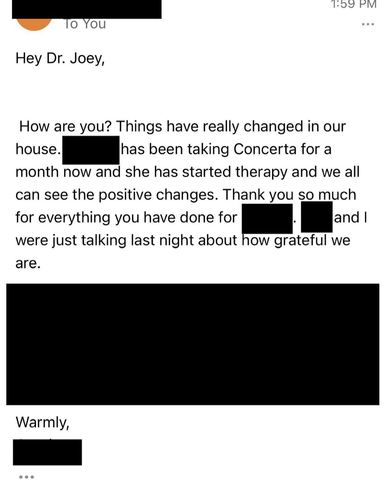

???

- mom emailed about 2-3 months later 

---

name: snoop
class: middle, right, lbc
background-image: url(https://gifs.joelglovier.com/favs/snoop-turning-the-wheel-big.gif)
background-color: #FFFFFF
background-size: auto

.lbc.pull-right[

"There are three ways to ultimate success:

The first way\l is to be kind.

The second way\l is to be kind.

The third way\l is to be kind."

]

???

- Mr Rogers
[](https://jasonstcyr.com/2019/11/27/building-trust-have-you-been-kind-today/)
